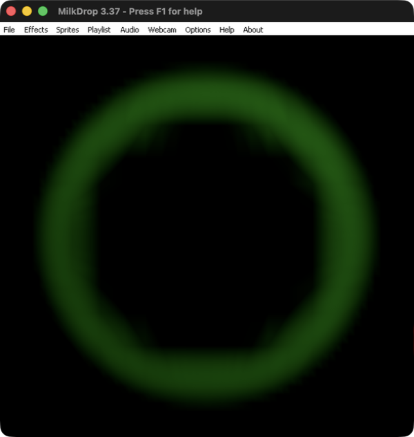
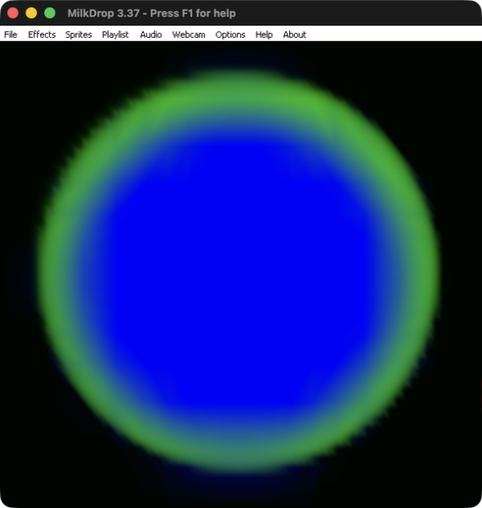
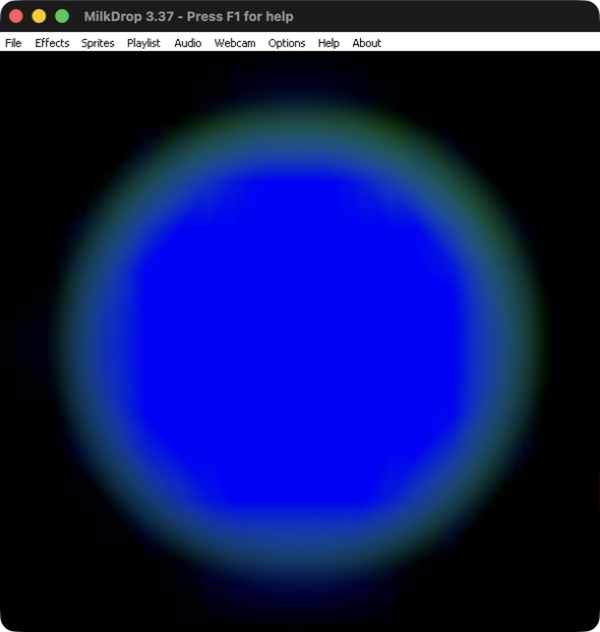

# MilkDrop 3 pipeline investigation and PR architecture decision

Updated follow-up: [primitive ordering, current-frame blur, progress and shader parser findings](milkdrop3-primitive-and-shader-investigation.md). That report supersedes the earlier inherited primitive and blur scheduling assumptions and records the current local implementation.

Investigated overnight 2–3 October 2026. This follows the [working Mac reference experiment](milkdrop3-reference-experiment.md). It compares the official 3.37 Wine executable with the current native Hex MILK prototype. No application implementation was changed and no PR was opened in this investigation.

## Follow-up implementation, 3 October 2026

The [shared-stage prototype](milkdrop3-shared-stage-prototype.md) now reproduces the green interaction ring, retained-feedback strengthening and composite-only exclusion in native Hex. Classic gradient/feedback output is pixel-identical before and after the refactor. Circle and vertical orientation were corrected; masks and complete pipeline fidelity remain experimental. The investigation below documents the earlier compositor and why it had to change.

## Decision

**Do not develop exact `.milk2` support around the current final-image compositor.** A controlled input makes both independent preset outputs black, but the official renderer produces a green ring. Hex produces black from the same input. No mask applied to two black finished images can reproduce that result.

The reference also shows a feedback-dependent increase in the cross-preset signal after a visible frame counter reaches at least 255 frames. The appropriate foundation is two preset evaluation states cooperating within a render pipeline that exposes shared intermediate images and feedback. The exact number of buffers, scheduling, primitive order and complete mask formulas remain to be established.

The native MILK module, immutable preset import, project persistence, transactional loading, host input and composition integrations remain useful. The incompatible portion is the execution strategy for a double preset, not Hex's broader architecture.

## Controlled diagnostics

These inputs are original constant-shader diagnostics, with no third-party textures, closed shaders or audio dependence. Each double uses cercle, progress 0.5, direction 1, and saved random values 0.2, 0.4, 0.6, 0.8 and 0.5.

| Input | Warp shader | Composite shader | Purpose |
| --- | --- | --- | --- |
| Hidden red A | Constant red | Constant black | Inject a signal before compositing while hiding the preset's final output |
| Black detector B | Constant black | Input texture's red channel displayed as green | Detect another preset's warp-stage contribution |
| Memory detector C | Input texture multiplied by 0.9 | Input texture's red channel displayed as green | Detect persistent cross-preset image input |
| Composite red D | Constant black | Constant red | Check whether final composite output enters the tested feedback path |

Classic A, B and C each render black in both reference and Hex. Classic D renders red. These controls establish that the detector's green output is not a default wave, missing texture or unrelated fallback visual.

### Shared image between warp and composite

Input `05-shared-current-warp.milk2` combines A and B. B's warp is explicitly black; there is no feedback sampling in either warp shader. Nevertheless, its composite shader detects red in the common input image and produces a green ring in the official renderer. The measured reference crop contains 86,972 green-dominant pixels, defined as G exceeding both R and B by more than 20 levels. Repeated captures are identical. Hex's matching 180-frame run is entirely black; a separate 600-frame run was also black with no GL error.

This directly rejects independent complete-preset rendering followed by final-image mixing. It is consistent with mixing warp-stage images before both composite shaders sample the resulting image. The ring is compatible with complementary spatial weights: where one preset contributes to the shared warp image, the other composite sees it. It does not by itself prove the exact weighting equation or GPU scheduling.




### Feedback coupling and frame-counter verification

Input 06 replaces B's constant-black warp with C's memory warp. Reference output has a stronger green signal than input 05, while Hex remains black. Initial and delayed reference pairs vary over time. These captures establish activity, but they are not a controlled recurrence fit: the first version did not explicitly fix all warp transforms or encode frame count.

Input 08 addresses those limitations. It specifies identity warp transforms, continuously injects red through A's warp, and publishes a persistent equation counter through Q1. A's composite displays `saturate(q1 / 255)` in blue. The central region reaches the calibrated full-blue baseline, indicating at least 255 evaluated frames. The detector still displays a green ring. Native Hex renders blue from the counter but no green from cross-preset feedback after 600 controlled frames.

Input 09 differs from 08 only in the memory warp's multiplier: 0 instead of 0.9. Both reference captures reach the full-blue counter level. The reference's maximum green channel is 177 with retention 0.9 and 85 with retention 0. This difference is observational evidence of a memory contribution; the values are captured color-managed channel levels, not linear-light weights. It rules out explaining the larger signal solely as the current-frame shared-warp effect.





This does not yet distinguish every possible implementation involving shared history, copied intermediate images or sequential warp processing. In particular, it does not prove that both warp shaders always read exactly the same previous-frame texture. It does establish that completely independent image histories and finished-image outputs cannot reproduce these probes.

### Composite output and feedback tap

Input 07 combines D, which displays red only in its composite shader, with the memory detector C. Its measured reference captures have no green-dominant pixels, despite the visible red output. This contrasts with the warp-injected red signal. It is consistent with feedback being retained before final composite rendering in this configuration.

This is a localized observation with shapes, waves and sprites disabled, not a universal proof of every feedback tap. Blur, primitive draws, sprites, transitions and shaderless variants still need their own controls.

## Correction to earlier feedback fixtures

The previous generator used `q1=q1+1` as a frame counter. Native testing shows its blue counter reaches only 1/255 even after 600 frames; the reference similarly does not show an advancing blue counter. In the pinned projectM code, `PerFrameContext::LoadStateVariables` explicitly restores Q values from their post-init values each frame. A Q variable is therefore not suitable as the persistent counter in this diagnostic.

The corrected equations are:

```ini
per_frame_init_1=framecounter=0;
per_frame_1=framecounter=framecounter+1; q1=framecounter;
```

The native 600-frame instrumented probe now reaches full blue, and the reference reaches its full-blue baseline. The [fixture generator](milkdrop3-blend-fixtures.py) was corrected to use the persistent counter before publishing it through Q1. Earlier feedback pulse fixtures remain generation-only evidence and should be regenerated. This correction does not invalidate the thirty constant-color mask captures, which did not use the counter.

## Native mask comparison

The standalone [native probe](milkdrop3-native-probe.cpp) renders directly through the current `MilkDropRuntime` in a hidden macOS OpenGL 4.1 context, at 600 by 580 pixels. It uses the existing pinned projectM library and unmodified application runtime source. Reference PNGs include window chrome; the compared reference crop `(4,55,596,625)` aligns with native crop `(4,4,596,574)`, both 592 by 570 pixels.

The same thirty inputs produced twenty rendered native outputs and ten unsupported-pattern rejections. The exploratory probe originally allowed the import exception to escape for those unsupported inputs, so its manifest records terminated subprocesses. Those are probe-level parser rejections, not observed crashes of the Hex application. The production application's transactional loading is a separate path.

The comparison classifies each pixel by whether red exceeds blue. It is a coarse region-orientation check, not a color-managed pixel-fidelity score. It does not measure blend softness, correct gamma, mask formulas, aspect-ratio coverage or motion.

| Pattern | Red/blue region agreement | Meaning at this configuration |
| --- | ---: | --- |
| cercle | 1.96% | Almost opposite source-color placement; inverting the classification gives 98.04% |
| vertical | 1.12% | Almost opposite placement; inversion gives 98.88% |
| horizontal | 98.52% | Similar region orientation, without proving the transition curve |
| side | 83.52% | Orientation is closer but shape/boundary still differs |
| plasma | 59.50% | Substantial geometric mismatch |
| snail | 47.76% | Substantial geometric mismatch |
| square | 22.78% | Substantial geometric mismatch beyond a simple polarity choice |
| triangle | 51.38% | Native output is red-dominant everywhere; reference divides the image |

Swapping the two inputs globally would improve circle and vertical while breaking horizontal. The mapping is pattern-specific. Replacing the shared-pipeline design is necessary, and recovering formulas and parameter mapping remains necessary as well.

Ten absent native pattern implementations are bubbles, checkerboard, cisor, clock, cross, cross2, lineshorizontal, nuclear, stars2 and wave. Full measurements, rejection diagnostics and rendered outputs are preserved in the [native manifest](milkdrop3-pipeline-assets/native/native-manifest.json) and [mask comparison](milkdrop3-pipeline-assets/native/mask-comparison.json).

## Where to change the renderer

The current `MilkDropRuntime::render` calls `projectm_opengl_render_frame_fbo` once for each engine, then samples their final FBOs in `milkBlendProgram`. That boundary is too late for the demonstrated interaction.

The pinned project's `MilkdropPreset::RenderFrame` already contains distinct operations: per-frame evaluation, previous-image setup, motion vectors, warp mesh/shader, blur update, custom shapes and waves, waveform, borders and final composite. Its own framebuffer swap retains a pre-composite image for the following frame. These components are reusable, but the public complete-frame call does not expose the cooperation needed by the double preset.

A proposed stage interface should allow the host to:

1. Evaluate each preset's equations and retain its own parameter state.
2. Select and bind the image inputs for each warp pass.
3. Render and combine warp-stage contributions into a shared intermediate image.
4. Insert primitive, blur and sprite stages at positions established by additional reference probes.
5. Run both composite shaders against the appropriate common intermediate inputs.
6. Combine display contributions and retain the correct feedback image separately from the displayed image.

That is an architectural proposal, not an implemented or fully verified reconstruction. Avoid exposing a fixed stage order for primitives until the next tests establish it. Preserve single-preset behavior while splitting the double-preset execution path.

## PR recommendation

A review PR can retain the native module foundation, owned fixtures and these evidence artifacts. Describe the current double renderer as an approximation and include the black-versus-green diagnostic as the concrete reason its pipeline needs replacement. Do not present repaired masks alone as a complete compatibility fix.

Before a fidelity-focused implementation PR, the next narrow milestone is a shared-stage prototype that reproduces input 05, the zero/0.9 feedback comparison and the composite-only control, without changing classic `.milk` rendering. Then investigate shapes/waves, sprite layering and burn behavior, blur inputs, shaderless rendering and transitions between complete doubles.

Shader-language failures, audio/FFT calibration, closed-cache decoding, asset resolution, Release performance and platform packaging remain separate work. None was resolved by this investigation. A full renderer rewrite is not established as necessary; exposing and coordinating the existing stages is the first implementation to test.

## Evidence and reproduction boundaries

Reference provenance is unchanged: official MilkDrop 3.37 Wine executable SHA256 `49cda4eed99f41223f2a70794b22716249449d285b958dae052c28caf84ee012`, Wine Staging 11.18, Vulkan/MoltenVK and native ScreenCaptureKit. Native output is from the current local prototype and pinned projectM revision `dd89dfba0852c0c7e0c4e668929118d91ec3a3f0`.

The [reference manifest](milkdrop3-pipeline-assets/reference/reference-manifest.json) preserves the initial seven cases and their paired measurements. The later instrumented cases are separate from that run. Archived inputs and supplementary hashes record exactly which counter and transform version produced the later images. No proprietary preset or shader-cache payload is added to this evidence set.
