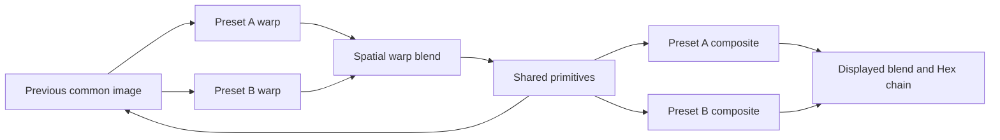

# Native MILK implementation and review handoff

Validated 3 October 2026 against Hex Composer app base `f9ae3b3d60c977fad1dee885114092cad9ec89c2`.

This implementation adds MILK as a source inside Hex Composer's existing composition system. It is ready for developer review as an experimental integration. It does not establish complete MilkDrop 3 compatibility. The app retains its generators, video, effects, modulation, feedback, mixer, recording and outputs.

The latest isolated macOS build passes the native GPU contracts, persistence, insert effects and modulation catalog checks. The selected, hashed reference corpus loads and renders 122 of 162 inputs. The other 40 reject explicitly: 24 sprite wrappers, 10 missing-texture cases and 6 closed-cache references. A three-frame loading smoke is not a visual fidelity or steady-state performance benchmark. [Input manifest](milkdrop3-order-assets/corpus-inputs.json), [current results](milkdrop3-pr-assets/native-gpu-corpus.txt), [source provenance and limits](milkdrop3-pr-assets/validation.json).

## What the module provides

Up to eight MILK modules can be placed in a chain. Each has independent equations, GPU state, clock and preset feedback. Import, drag and drop, restart, clear, undo, patch and bank persistence, clipboard, Mix, Blend, Insert FX, AUX sends and modulation use Hex's existing paths. Original preset text and bounded local image assets travel with the patch; live execution state is recreated on recall.

Failed imports preserve the loaded runtime. Unsupported sprites, unknown double masks, missing textures, shader compiler failures and `MD31`/`MD32` references report errors instead of substituting a plausible-looking placeholder. Mute follows current Hex behavior and produces empty transparency; downstream keying remains an explicit creative operation. A full-frame MilkDrop image can intentionally contain opaque black.

The backend is a replaceable shared projectM library pinned to `dd89dfba0852c0c7e0c4e668929118d91ec3a3f0`, with a cumulative 35-file patch. The source-revision guard rejects mismatched checkouts. Build and packaging changes carry the engine's license notices, upstream source reference and corresponding local patch. No official preset pack, proprietary cache payload or MDropDX12 renderer implementation is bundled. The CI packaging paths copy the shared engine and its notices, Linux uses a relative `lib/` search path, and the external MSVC build follows Hex's static C runtime policy. Windows dependency checks inspect both the app and engine DLL. These paths have source and syntax checks; their packaged execution still needs platform validation.

## Double preset rendering

Each embedded preset keeps its own equation state. Both warp stages read the same previous pre-composite image. Hex mixes their warp images, then draws primitive groups onto that shared image with the measured global opacity and B-before-A order. Both composite shaders read the shared result. Their displayed outputs are mixed separately. The retained feedback image excludes the final displayed composite.



Owned controls distinguish this pipeline from blending two independently completed images. They also establish current-frame composite blur after primitives, retained prior blur for warp, equation advancement once per full frame, shared-image reset on resize, and independence from downstream Hex effects. These findings narrow the architecture; they do not prove every primitive or transition behaves identically. [Pipeline experiments](milkdrop3-pipeline-findings.md), [primitive and shader experiments](milkdrop3-primitive-and-shader-investigation.md).

The first warp can request previous-frame blur before any blur chain exists. A native binding trace identified texture-zero bindings as the macOS unloadable-texture warning. Complete black textures now provide that initial state. The real warning-producing preset renders without the warning, and the repeated selected corpus contains zero occurrences. The owned GPU test reads all three initial blur levels and checks black output. [Before trace](milkdrop3-pr-assets/texture-before.txt), [after trace](milkdrop3-pr-assets/texture-after.txt).

## Shader and equation extensions

The patch adds Q33 through Q64, sixteen custom shapes and waves, 500-sided shape geometry, normalized FFT helpers, mouse input and saved random values. Explicit bare sampler declarations resolve to their actual texture assets; unused declarations and sampler macro aliases have dedicated controls. The vector `aspect` binding supports local shadowing, with declaration initializers resolving the outer binding. Standard scalar and vector `tanh` overloads translate to GLSL. Numbered equation entries concatenate as fragments after stripping line comments, while shader entries preserve line breaks.

The selected corpus has no observed HLSL or equation parser failures after these fixes. This is evidence for those inputs, not a complete HLSL language conformance claim. Shader model extensions, precision, texture behavior, audio analysis and timing still need broader comparison.

## Files to review first

| Area | App source |
| --- | --- |
| Preset parsing and asset limits | `src/renderer/milk_format.h`, `milk_preset.h` |
| Runtime and shared double rendering | `src/renderer/milk_runtime.cpp`, `milk_runtime.h` |
| Native composition integration | `src/renderer/crt_renderer.cpp`, `src/engine/engine.cpp` |
| Module controls and import lifecycle | `src/modules/milk_module.h`, `src/app.cpp` |
| Patch persistence and identity | `src/io/patch_serializer.cpp`, `patch_snapshot.h` |
| Dependency pin, patch and notices | `cmake/MilkDrop.cmake`, `ApplyProjectMPatch.cmake`, `ProjectMSource.txt.in`, `projectm-milk3.patch` |
| Behavioral checks and owned inputs | `tests/milk_module_test.cpp`, `tests/fixtures/milk` |

The PR is assembled against current remote main. It preserves the app's recent recording HUD, file migration, transparent chain, media aspect and insert-shader fixes. Existing unrelated local rebrand and favicon work stays in the original checkouts.

## Reproduce the checks

From the app PR checkout, with the project's ordinary platform build prerequisites installed:

```sh
cmake -S . -B build-milk -DCMAKE_BUILD_TYPE=Debug -DGLAD_REPRODUCIBLE=ON
cmake --build build-milk --target vizard milk_module_test patch_snapshot_json_test insert_fx_test target_catalog_test --parallel 2
./build-milk/milk_module_test
./build-milk/patch_snapshot_json_test
./build-milk/insert_fx_test
./build-milk/target_catalog_test
./build-milk/milk_module_test --gpu
```

The CMake target remains `vizard`; current packaging names the executable `hexcomposer` or `hexcomposer.exe`. Debug ensures assertion-based checks execute. GPU checks need a real OpenGL 4.1 context. On macOS, the catalog check needs native MIDI access; the restricted shell initially prevented MIDI initialization, then the native run passed. The optional external-corpus command is:

```sh
./build-milk/milk_module_test --gpu /path/to/reference/presets --milk3
```

That selector is documented by the checked-in manifest; the reference pack is not a distributed test asset. Cold compilation contributes to its timings. Build from a fresh pinned projectM checkout was verified locally. Existing fetched host dependency sources were reused at their declared revisions. The wrong-revision rejection and already-applied patch checks pass. The documentation branch passes `npm run check` with 104 built pages. No release package, native Windows run or Linux runtime was tested in this pass.

## Remaining gates for comprehensive support

| Gap | Concrete next work |
| --- | --- |
| Closed shaders | Decode the third cache and prove its identifier mapping before integrating translated bytecode. The previous 1151 successful ordinary payload translations do not settle that mapping. |
| Sprite wrappers | Measure layer, burn, color-key, transform and expression lifecycle using owned reference controls. projectM's sprite engine exists, but its current behavior is insufficient evidence for faithful wrapper support. |
| Double masks | Recover the ten unsupported patterns and measure all curves on asymmetric imagery across progress, direction, saved randoms and aspect ratios. The twenty implemented masks remain approximate. |
| Other rendering behavior | Compare motion vectors, echo, custom waves, shaderless presets and transitions between complete doubles. Preserve comparisons by runtime version. |
| Assets and persistence | Broaden texture formats and resolution rules, investigate the ten missing assets, and measure patch size and memory when capturing whole conventional texture folders. Synthetic diagnostic images are never normal fallback assets. |
| Audio and performance | Replay recorded PCM with fixed timing; measure warm frame times, memory, shader warmup and multiple active modules at useful resolutions. |
| Platform validation | Obtain native Windows comparisons and exercise Windows/Linux build and packaging paths. Wine reference results remain a separate evidence class. |
| Product adoption | Build dependable browsing, diagnostics and authoring, then file associations and creator workflows. Establish coverage and visual quality before marketing universal support. |

The recommended review is the runtime boundary and source provenance first, then the owned behavioral tests and native module lifecycle. Broader compatibility work can proceed on that foundation while Hex remains a full composition instrument. [Adoption strategy](milkdrop-compatibility-and-adoption-strategy.md), [closed-cache findings](milkdrop3-format-and-shader-findings.md).
