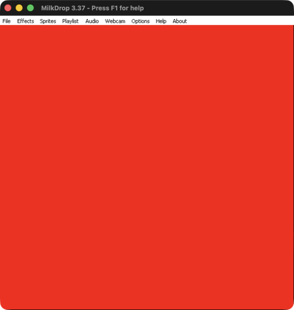
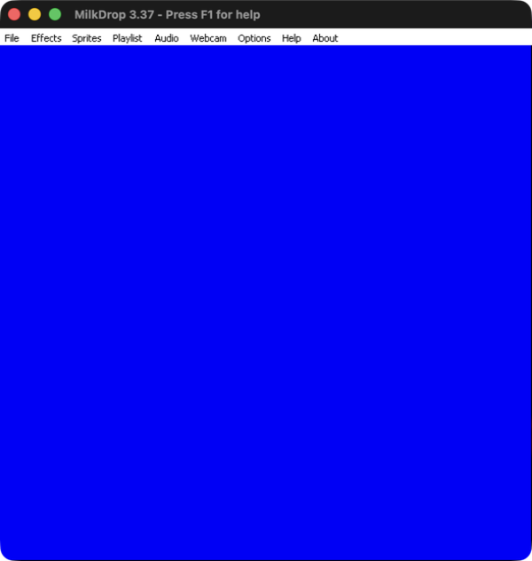
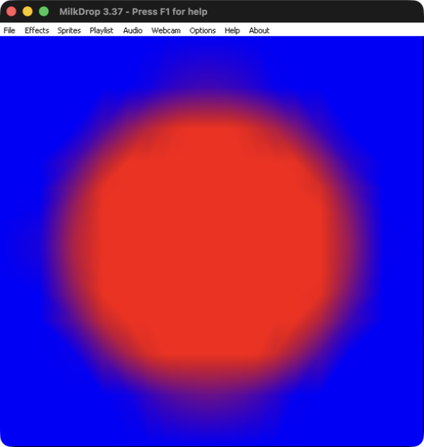
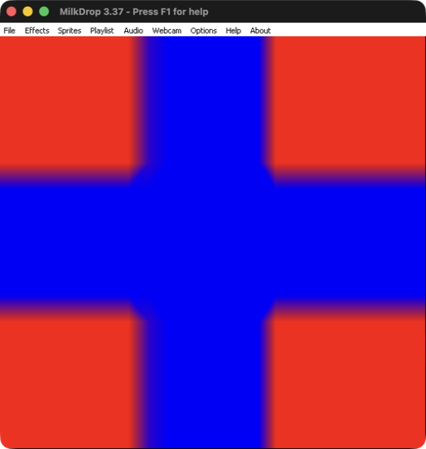

# MilkDrop 3 reference-render experiment

Executed 2 October 2026. This follows [the format and shader investigation](milkdrop3-format-and-shader-findings.md) and informs [the Hex Composer integration strategy](milkdrop-compatibility-and-adoption-strategy.md).

## Current result

The follow-up Mac experiment recovered a working renderer and native capture path using Wine’s Vulkan backend. Constant-red and constant-blue baselines rendered successfully. All thirty mask patterns were captured twice at a fixed configuration; every measured repeat was pixel-identical. Four further cross2 captures established nonuniform behavior at higher progress values. See [the Mac recovery findings](#mac-recovery-experiment-working-reference-route) below; the initial failures remain documented separately.

## Initial OpenGL attempt

The official MilkDrop 3.37 installer and renderer were executed locally. The initial reference-render attempt did **not** produce usable frames. No diagnostic preset was successfully loaded and captured; no blend formula, feedback architecture, closed-shader lookup or visual parity result was established.

This is a failed reference-environment experiment, not evidence that the presets or proposed Hex implementation fail. It narrows the immediate dependency to a functioning reference renderer and capture path. The separate successful translation experiment remains valid: all 1,151 ordinary cached shader payloads translated without reported errors through three MojoShader profiles. GPU compilation and rendering of those translations remain untested.

## Environment and provenance

| Component | Pinned evidence |
| --- | --- |
| Host | macOS, Apple M1 arm64; Rosetta already installed |
| Official installer | MilkDrop 3.37, 92,005,440 bytes |
| Installer SHA256 | `e155ca7e600acbb59e91c6ca55a3bcf2c8c7358cead808429ecb8d158bd888d5` |
| Extracted renderer | `MilkDrop 3.exe`, 1,544,256 bytes |
| Renderer SHA256 | `49cda4eed99f41223f2a70794b22716249449d285b958dae052c28caf84ee012` |
| Wine | Gcenx Wine Staging 11.18 macOS build, portable temporary installation |
| Windows inspection harness | Official embedded Python 3.13.0 amd64, ctypes Win32 APIs |
| Isolation | Separate temporary Wine prefix and package directory; no global Wine installation |

The [official MilkDrop Wine guide](https://raw.githubusercontent.com/milkdrop2077/MilkDrop3/main/linux/README.md) documents Linux and Wine, including a special executable selected by its installer. It does not establish macOS support. We did not verify which runtime variant the installer selected in this macOS experiment, so these observations must not be generalized to its supported Linux setup. [Wine build provenance](https://github.com/Gcenx/macOS_Wine_builds/releases/tag/11.18).

The previous static package extraction contained resources but omitted the actual renderer executable. Running the installer extracted the renderer in addition to those resources. Future reference records must hash the executable actually run, rather than only the outer installer.

## Observations in execution order

1. The portable Wine runtime initialized successfully, and embedded Windows Python executed. A separate Notepad window provided a basic control application.
2. The official installer created a window titled `MilkDrop 3.37 Installer`. Windows `EnumWindows` and `EnumChildWindows` exposed its edit control and extraction buttons. The Mac app-selection tool could not control this Wine-hosted window, and native per-window screenshot capture failed.
3. Windows control messages set the extraction directory to the isolated temporary directory. The installer confirmed the existing directory and extracted `MilkDrop 3.exe`. Bounded messages and asynchronous button messages allowed inspection without indefinitely blocking on modal dialogs.
4. The actual renderer displayed an audio-capture error. Dismissing the error allowed it to create `MilkDrop 3.37 - Press F1 for help`, class `Direct3DWindowClass`. This corrects the earlier tentative observation that the audio error alone prevented further startup.
5. Wine then reported an unhandled read at address `0x60`, instruction address `0x00006FFFFDB7A8DA`, thread `0x01b8`, and opened its debugger. The fault was not traced to a specific MilkDrop function, shader, driver or audio component. Root cause is unestablished.
6. The Windows GDI capture harness obtained window dimensions and bitmap storage, but `BitBlt` returned zero. Saved installer and renderer images were black. A repeated Notepad control capture also returned zero. These are invalid captures; neither black pixels nor a populated bitmap establish successful rendering.
7. The isolated Wine prefix was stopped. Existing Hex preview processes and app implementation files were left untouched. Downloaded runtimes, prefix and original temporary evidence were retained for diagnosis.

The renderer was initially started with the package's original startup configuration, not a diagnostic `.milk2`. Startup and capture failed before the intended pattern sweep. **Zero of the thirty mask cases and zero of the thirty feedback cases have reference results.** The thirty-pattern count remains executable-label evidence, not tested behavioral coverage.

## Diagnostic fixture correction

The [fixture generator](milkdrop3-blend-fixtures.py) now emits 64 original inputs: thirty double-preset mask tests, thirty double-preset feedback tests, and four classic `.milk` baselines. Generation succeeded locally. Their acceptance by MilkDrop remains unverified.

The mask tests output red from preset one and blue from preset two, at header progress 0.5, direction 1 and fixed random values. They provide a starting point for measuring spatial weights, but cannot establish behavior across every parameter.

The earlier feedback fixture seeded while `time < 0.1`. That is unsuitable unless the reference engine resets shader time on each preset load. It could silently miss its injection window. The latest correction initializes a persistent `framecounter` per preset, increments it per frame and publishes it through `q1` to inject the impulse for the first six frames. The intervening Q1-only counter was found to reset every frame; regenerate the feedback fixtures before using them. This removes reliance on application uptime; it still requires reference confirmation of equation initialization, q-variable shader binding and preset reset behavior. Capture by verified frame index, not an arbitrary delay after clicking load. Compare trajectories after injection ends, and disable automatic preset switching.

Classic red, blue and impulse baselines must run first. They distinguish shader syntax and expression-binding failures from wrapper parsing and blending. A blank double preset is uninterpretable if its components were never independently validated. Feedback decay is per frame, so frame cadence must also be pinned.

## What the findings change

The parser and bytecode evidence support continued work on a native MILK module within Hex's existing composition system. This run supplies no justification to copy guessed masks into a renderer and describe them as exact compatibility.

A native Windows reference machine is the preferred next environment because it avoids the additional Wine, Rosetta, macOS graphics and capture variables encountered here. A working Linux/Wine environment can provide secondary evidence, clearly labelled. Wine startup failure is not a reason to make Wine part of Hex's shipped architecture.

Closed-shader support still needs its own investigation. The known MD31/MD32 identifiers and third cache do not yet have a proven mapping or decoder. This experiment did not submit or trace a closed shader. The successful ordinary-cache translator tests cannot be extrapolated to that cache.

## Next execution protocol

1. Pin the actual renderer version and executable hash, record display and rendering settings, and validate lossless capture using a known static color. Validate ordinary `.milk` baselines before `.milk2` cases. Keep overlays, automatic transitions and unrelated sprites disabled.
2. Load each mask fixture. Capture repeated identical runs, then sweep progress (including 0 and 1), both directions, multiple random inputs, aspect ratios and dimensions. Endpoint behavior must be measured rather than assumed. Validate repeatability before fitting formulas.
3. Measure linearized red/blue channels and their sum. Gamma and nonlinear processing can invalidate a naive `blue / (red + blue)` interpretation. Check brightness and color invariants and determine which output component corresponds to each preset before defining a weight convention.
4. Run the feedback baselines and doubles with verified preset resets. Record the injection window and later frames. Determine whether trajectories and decay match two independent histories; disagreement requires intermediate-pass analysis. Final-frame masks alone cannot prove shared or independent feedback.
5. Only then test primitive order, sprites, transitions between complete doubles, and closed presets. Trace actual shader identifiers and submitted bytecode separately, with permitted assets and documented dependencies.
6. Save input and asset hashes, configuration, raw captures and measurements in a durable corpus. Implement candidate semantics behind the MILK runtime and compare against that corpus. Keep Hex's composition, modulation, mixer and output behavior in separate integration checks.

Until those gates pass, report `.milk2` loading, approximate composition, ordinary bytecode translation and exact visual compatibility as separate capabilities.

## Temporary reproduction paths

Runtime: `/private/tmp/hex-milk-wine-runtime/Wine Staging.app`.
Prefix: `/private/tmp/hex-milk-reference-prefix`.
Installed package: `/private/tmp/hex-milk-reference-run`.
Inspection scripts: `/private/tmp/hex-milk-win-inspect.py`, `hex-milk-win-inspect-all.py`, `hex-milk-win-capture.py`.
Revised fixture output: `/private/tmp/hex-milkdrop3-blend-fixtures-v2`.

These paths are diagnostic scratch space and may disappear. The fixture generator and this report are the durable handoff; no proprietary executable or shader cache has been copied into the documentation repository.

## Mac recovery experiment: working reference route

The follow-up investigation established a working reference-render route on this Mac. A separate Windows machine is not required to continue the behavioral investigation. The initial failed OpenGL attempt above remains historical evidence; it does not describe the recovered Vulkan configuration.

Resource enumeration of the installer established that the extracted renderer is byte-for-byte identical to its `RCDAT / LINUX` resource, with the same SHA256 already recorded above. The installer had selected the correct Wine executable. Its other bundled renderer variants, MD32 and MD64, have different hashes. Selecting the wrong executable was therefore ruled out for this run.

The installer also embeds native DirectX helpers. Resource export names identify DX3 as x64 `d3dx9_31.dll` and DX4 as x64 `d3dx9_43.dll`. Load tracing confirmed that MilkDrop loaded its package-local native helpers from `Milkdrop3/data`. Explicit native DLL overrides were retained for reproduction, but these observations do not prove that missing DLLs caused the original failure.

The OpenGL run logged `GL_INVALID_FRAMEBUFFER_OPERATION` during `glClear`. A further run limited to OpenGL 4.1 with the multithreaded command stream disabled still produced the error and black output. Switching Wine's own renderer to Vulkan through its bundled MoltenVK runtime produced visible MilkDrop output. This uses Wine's renderer, not DXVK. The Vulkan run does not establish native Windows GPU parity or explain every cause of the earlier page fault. [Wine renderer configuration source](https://github.com/wine-mirror/wine/blob/master/dlls/wined3d/wined3d_main.c).

The reproducible environment additions are:

```sh
export WINEPREFIX=/private/tmp/hex-milk-reference-prefix
export WINE_D3D_CONFIG=renderer=vulkan,csmt=1
export WINEDLLOVERRIDES=d3dx9_31,d3dx9_43=n,b
```

Run `MilkDrop 3.exe` with its package directory as the working directory. The audio-capture warning still occurs on this setup; dismissing it allows the audio-independent diagnostic tests to render. This is not validation of audio-reactive behavior. Startup can be delayed: wait for the observed dialog and renderer window instead of assuming readiness from process creation. No global registry change or system installation was needed.

The capture problem was solved separately. A macOS permission preflight reported existing screen-capture access. A small AppKit-initialized ScreenCaptureKit helper captured the specific MilkDrop window, including its child windows. Windows GDI `BitBlt` remained unsuitable; `PrintWindow` returned success while yielding black images, demonstrating why API success alone is insufficient. The durable [capture helper](milkdrop3-sck-capture.swift) can be compiled with `swiftc`; it captures only the matching MilkDrop renderer window and accepts an output PNG path. [Apple ScreenCaptureKit](https://developer.apple.com/documentation/screencapturekit).

### Validated diagnostic inputs and capture controls

The classic baseline format was corrected again: `.milk` files now begin with `MILKDROP_PRESET_VERSION`, without the `NAME` line used in embedded `.milk2` sections. The corrected constant-red and constant-blue baselines rendered their intended colors. This replaces generation-only confidence with an actual source-shader render check.

The original package's presets were preserved under `presets-original` inside the temporary experiment installation. Its active preset directory held only two color baselines and thirty mask double presets. This made the browser ordering inspectable. Windows messages opened the documented `L` preset browser, selected an entry, loaded it, and hid the browser with Escape. The blue preset was explicitly locked and subsequent inputs loaded under that lock, preventing automatic switching. Startup logos and browser overlays were excluded from the measured captures.

The native captures are 600 by 632 pixels, including window chrome. Repeatability measurements compare the interior rectangle `(4, 55, 596, 625)`, a 592 by 570 pixel crop. The source input header uses progress 0.5, direction 1, and random values 0.2, 0.4, 0.6, 0.8 and 0.5. These are one tested configuration, not a parameter sweep.

Color management matters: in the saved PNGs, the dominant red-baseline triplet is `(234, 51, 35)` and blue is `(0, 0, 245)`, rather than their source-shader RGB literals. Preserve the image color profile and calibrate against both baselines before estimating weights. Raw red/blue channel division would not be a valid exact mask recovery method for these captures.

The cercle test produces a red central region, blue exterior and smooth spatial boundary. Its two interior captures were byte-identical. This demonstrates an actual spatial blend for the diagnostic input, rather than a uniform final-image crossfade. It does not determine the complete formula, resolve primitive order or establish feedback sharing.





### Implications for Hex Composer

The Mac is now usable for collecting controlled MilkDrop reference images. Continue algorithm recovery and native Hex validation from this configuration, with its Wine/Vulkan provenance visible. Treat a later native Windows comparison as independent corroboration rather than a prerequisite for all progress.

Nothing in this result changes the product architecture: Hex keeps its existing composition capabilities; the MILK module hosts compatibility behavior. Wine is a temporary reference-testing tool, not a proposed shipped dependency. Feedback-state tests, parameter sweeps, shader resource bindings and the third closed-shader cache remain separate investigations.

### Completed thirty-pattern capture set

All thirty diagnostic mask inputs were loaded at the fixed header configuration and captured twice. The measured interior crops were identical for every pair: mean absolute RGB difference zero and maximum channel difference zero. All thirty first-capture crop hashes differ from each other. Twenty-nine cases show spatial variation; cross2 is uniform red at this configuration. These results establish repeatability in this reference environment, not the correctness of a proposed Hex implementation.

The [capture manifest](milkdrop3-reference-assets/manifest.json) records browser indices, input filenames and SHA256 hashes, paired capture filenames, crop hashes, color counts and repeat differences. The authored inputs are preserved under [reference assets](milkdrop3-reference-assets/inputs/Hex%20reference%20mask%20cercle.milk2). Each source hash was verified against its archived input. Raw window captures preserve the captured color profile.

| Pattern | Paired capture | Distinct RGB triplets in crop | Maximum repeat difference |
| --- | --- | ---: | ---: |
| arrow | [first](milkdrop3-reference-assets/arrow-a.png), [repeat](milkdrop3-reference-assets/arrow-b.png) | 623 | 0 |
| bubbles | [first](milkdrop3-reference-assets/bubbles-a.png), [repeat](milkdrop3-reference-assets/bubbles-b.png) | 873 | 0 |
| cercle | [first](milkdrop3-reference-assets/cercle-a.png), [repeat](milkdrop3-reference-assets/cercle-b.png) | 760 | 0 |
| checkerboard | [first](milkdrop3-reference-assets/checkerboard-a.png), [repeat](milkdrop3-reference-assets/checkerboard-b.png) | 854 | 0 |
| cisor | [first](milkdrop3-reference-assets/cisor-a.png), [repeat](milkdrop3-reference-assets/cisor-b.png) | 781 | 0 |
| clock | [first](milkdrop3-reference-assets/clock-a.png), [repeat](milkdrop3-reference-assets/clock-b.png) | 749 | 0 |
| corner | [first](milkdrop3-reference-assets/corner-a.png), [repeat](milkdrop3-reference-assets/corner-b.png) | 607 | 0 |
| cross | [first](milkdrop3-reference-assets/cross-a.png), [repeat](milkdrop3-reference-assets/cross-b.png) | 597 | 0 |
| cross2 | [first](milkdrop3-reference-assets/cross2-a.png), [repeat](milkdrop3-reference-assets/cross2-b.png) | 2 | 0 |
| curtain | [first](milkdrop3-reference-assets/curtain-a.png), [repeat](milkdrop3-reference-assets/curtain-b.png) | 227 | 0 |
| donuts | [first](milkdrop3-reference-assets/donuts-a.png), [repeat](milkdrop3-reference-assets/donuts-b.png) | 829 | 0 |
| horizontal | [first](milkdrop3-reference-assets/horizontal-a.png), [repeat](milkdrop3-reference-assets/horizontal-b.png) | 341 | 0 |
| lineshorizontal | [first](milkdrop3-reference-assets/lineshorizontal-a.png), [repeat](milkdrop3-reference-assets/lineshorizontal-b.png) | 155 | 0 |
| linesvertical | [first](milkdrop3-reference-assets/linesvertical-a.png), [repeat](milkdrop3-reference-assets/linesvertical-b.png) | 153 | 0 |
| nuclear | [first](milkdrop3-reference-assets/nuclear-a.png), [repeat](milkdrop3-reference-assets/nuclear-b.png) | 972 | 0 |
| patches | [first](milkdrop3-reference-assets/patches-a.png), [repeat](milkdrop3-reference-assets/patches-b.png) | 957 | 0 |
| plasma | [first](milkdrop3-reference-assets/plasma-a.png), [repeat](milkdrop3-reference-assets/plasma-b.png) | 838 | 0 |
| plasma2 | [first](milkdrop3-reference-assets/plasma2-a.png), [repeat](milkdrop3-reference-assets/plasma2-b.png) | 693 | 0 |
| plasma3 | [first](milkdrop3-reference-assets/plasma3-a.png), [repeat](milkdrop3-reference-assets/plasma3-b.png) | 615 | 0 |
| side | [first](milkdrop3-reference-assets/side-a.png), [repeat](milkdrop3-reference-assets/side-b.png) | 517 | 0 |
| snail | [first](milkdrop3-reference-assets/snail-a.png), [repeat](milkdrop3-reference-assets/snail-b.png) | 915 | 0 |
| snail2 | [first](milkdrop3-reference-assets/snail2-a.png), [repeat](milkdrop3-reference-assets/snail2-b.png) | 998 | 0 |
| snail3 | [first](milkdrop3-reference-assets/snail3-a.png), [repeat](milkdrop3-reference-assets/snail3-b.png) | 1173 | 0 |
| square | [first](milkdrop3-reference-assets/square-a.png), [repeat](milkdrop3-reference-assets/square-b.png) | 575 | 0 |
| stars | [first](milkdrop3-reference-assets/stars-a.png), [repeat](milkdrop3-reference-assets/stars-b.png) | 1041 | 0 |
| stars2 | [first](milkdrop3-reference-assets/stars2-a.png), [repeat](milkdrop3-reference-assets/stars2-b.png) | 1208 | 0 |
| triangle | [first](milkdrop3-reference-assets/triangle-a.png), [repeat](milkdrop3-reference-assets/triangle-b.png) | 771 | 0 |
| vertical | [first](milkdrop3-reference-assets/vertical-a.png), [repeat](milkdrop3-reference-assets/vertical-b.png) | 346 | 0 |
| wave | [first](milkdrop3-reference-assets/wave-a.png), [repeat](milkdrop3-reference-assets/wave-b.png) | 917 | 0 |
| zoom | [first](milkdrop3-reference-assets/zoom-a.png), [repeat](milkdrop3-reference-assets/zoom-b.png) | 1 | 0 |

The extra cross2 progress tests used the same random values and direction, changing only the progress header. Observed output was uniform red at 0, 0.25 and 0.5, spatially mixed at 0.75, and still spatially mixed at 1. This rules out treating a value of 1 as a universal fully replaced endpoint for this pattern under these conditions. The exact scaling and formula remain to be recovered. [Additional captures and input hashes](milkdrop3-reference-assets/cross2-progress-manifest.json).





The [Windows control helper](milkdrop3-win-reference-control.py) and [native capture helper](milkdrop3-sck-capture.swift) were also verified together by reloading cercle and reproducing its measured crop exactly. The reference set contains 64 double-preset captures in total: sixty from the paired thirty-pattern run and four additional cross2 progress captures. The two classic baseline images are separate.

The original brief-pulse feedback fixtures have not been reference-rendered or measured. Subsequent continuous-injection diagnostics now demonstrate intermediate-image and feedback coupling; see [pipeline findings](milkdrop3-pipeline-findings.md). There is also no direction/random/aspect/mesh-resolution sweep, no intermediate-pass tracing, no closed-cache decoder and no comparison to native Windows in this result. Those remain required before claiming total MilkDrop 3 compatibility.

## Subsequent pipeline finding, 3 October 2026

Controlled warp/composite probes reject the current independent-engine, final-image composition architecture. Both individual presets output black, but their official double produces a green ring through cross-preset intermediate-image interaction. A persistent frame counter and zero/0.9 retention controls further demonstrate feedback-dependent behavior. The native Hex runtime does not reproduce it. This supersedes the earlier blanket statement that all feedback behavior is untested, while exact scheduling and primitive order remain unresolved. [Architecture decision and evidence](milkdrop3-pipeline-findings.md).
